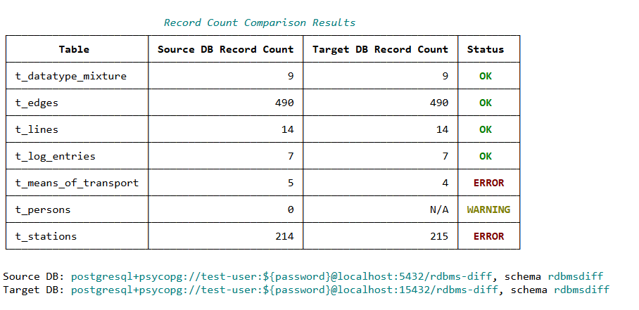

# RDBMS Diff - Tools for Comparison of Relational Databases

## Introduction
RDBMS Diff is a set of tools allowing to compare two relational databases. It is meant for use cases like:
* Database migration, for instance a migration from on-prem Oracle to AWS Aurora/Postgres. Such a use case was the original trigger for the development of the tool.
* Cloning of databases, for instance cloning of a production database to a test environment, or cloning a database from one cloud region to another cloud region.
The list of use cases outlined above is not complete, these are just few examples.

The following comparisons are provided:
* **Schema comparison** is able to detect situations when the schema of one of the databases accidentally deviates from the schema of the other database. Missing table, missing foreign key constraint or inconsistent datatype of a table column are examples of such a deviation.
* **Record count comparison** is able to detect situations when the overall number of records in a table in one of the database differs from the overall number of records in the same table in the other database.
* **Data comparison** is able to detect situations when a record in one of the databases has at least one column value distinct from its counterpart in the other database.

Implementing a completely generic tool that would be able to compare any combination of database engines, all possible datatypes etc. is more or less impossible (or at least very expensive in terms of implementation effort). Therefore, the tool should rather be seen as a solid foundation which can be forked and customized if it does not fully support some specific scenario.


## Source Code Organization
The source code is divided to four Python packages:
* [rdbmsdiff.foundation](./rdbmsdiff/foundation) package provides functionality common to two or more comparison tools. The classes and functions provided by this package are reusable, and the comparison tools are built on top of this reusable functionality. For instance, each of the three tools needs to read some meta-information from the compared databases. Therefore, the corresponding functionality is provided by the foundation package.
* [rdbmsdiff.schema](./rdbmsdiff/schema) package implements the comparison tool providing the schema comparison.
* [rdbmsdiff.recordcount](./rdbmsdiff/recordcount) implements the comparison tool comparing the overall number of records per table.
* [rdbmsdiff.data](./rdbmsdiff/data) implements the comparison tool comparing the records and detecting discrepancies in column values.

As outlined above, the packages implementing the three comparison tools depend on the foundation package. However, the packages implementing the comparison tools are independent of each other.


## Dependencies
All 3rd party dependencies (i.e. [pypi.org](https://pypi.org) packages) are documented in the [requirements.txt](./requirements.txt) file. If these packages are installed, all three comparison tools should work. The following list provides an overview of all dependencies and their purpose.
* [rich](https://pypi.org/project/rich/) package is used to generate pretty CLI output and HTML reports.
* [SQLAlchemy](https://pypi.org/project/SQLAlchemy/) is used as vendor independent database interface that ensures the capability of the comparison tools to interact with various database engines.
* [psycopg](https://pypi.org/project/psycopg) is a database adapter for PostgreSQL databases.
* [mysqlclient](https://pypi.org/project/mysqlclient/) is a database adapter for MySQL databases.
* [mariadb](https://pypi.org/project/mariadb) is a database adapter for MariaDB databases.

If you would like to use the comparison tools for other database engine like Oracle, you will have to take care about the corresponding database adataper(s).


## Environment Setup
Before using the tool, you have make sure all dependencies are installed. The most simple (and recommended) approach is the following:
1. Clone this Git repository, or download its contents to a host where you want to use the comparison tools.
2. Create and activate a new virtual environment (for instance, `python -m venv .venv` creates a new virtual environment).
3. Use `pip install -r requirements.txt` to install all dependencies to the virtual environment.
4. From the root directory of this project, use the commands documented by the subsequent sections of this document to start the particular comparison tools.


## Database Access and Permissions
To perform the comparisons, the tools reads meta-information about the schema from both databases. Because schema inspection and reading of record require access to system catalog tables and table data, the tool must be executed with database users that have sufficient permissions. The following privileges are required:
* **Metadata access.** Ability to query system catalog views (e.g., INFORMATION_SCHEMA or database-specific equivalents) to read schema definitions such as tables, columns, indexes, and constraints.
* **Read access to user tables.** Permissions to count rows in tables and fetch column values for specific comparisons.

**No write permissions are needed**. The tool does not modify data or schema objects, so privileges such as INSERT, UPDATE, DELETE, or DDL permissions do not have to be granted.


## Schema Comparison Tool
The following command will display instructions about how to start schema comparison.
```
python -m rdbmsdiff.schema.main -h
```

The comparison generates a summary to the standard output (see the screenshot below).


The generated summary can optionally be duplicated to an HTML file. The HTML summary hasa exactly the same structure as the summary written to the standard output.


Besides the summary, the tool also generates detailed report with all discrepancies found during the comparison. The report is written to a file in JSON format. The following screenshot illustrates the structure of the report.


Meta-information about schema is retrieved using SQLAlchemy API. In other words, the comparison tools do not query any vendor-specific system views directly. This approach keeps the reading of schema information vendor independent.


## Record Count Comparison Tool
The following command will display instructions about how to start comparison of record count for particular tables. Start this command in the root.
```
python -m rdbmsdiff.recordcount.main -h
```

The comparison generates a summary to the standard output (see the screenshot below). The generated summary can also be duplicated to an HTML file.


The generated summary can optionally be duplicated to an HTML file. The HTML summary hasa exactly the same structure as the summary written to the standard output.



## Data Comparison Tool
The following command will display instructions about how to start data comparison.
```
python -m rdbmsdiff.data.main -h
```

The comparison generates a summary to the standandard output (see the screenshot below).


The generated summary can optionally be duplicated to an HTML file. The HTML summary hasa exactly the same structure as the summary written to the standard output.


Besides the summary, the tool also generates a detailed report where you can see the details of every single validation. The detailed report contains a separate section for each of the validated tables. The section beings with the name of the table and a summary of validations performed for the table. The following screenshot illustrates the section for a table which no discrepancies has been found. In other words, all 11 validations performed for the table were successful, and the overall outcome of the validation of the concerned table is PASSED.


Within each table section, there are subsections dedicated to particular column validations. The screenshot above also shows the first two column validations. A column validation section always start with the name of the validaed column and the validator. This is followed by the outcome of the validation (PASSED or FAILED). Subsequently, a pair of SQL statements with the corresponding result-sets is shown. One of the SQL statements is performed in the source database, the other SQL statement is performed in the target database. If both SQL statements lead to the same result-set, the outcome of the validation is PASSED. If there is a discrepancy between the two result-sets, the outcome of the validation is FAILED. The following screenshot illustrates some failed validations.


It can also happen that one of the SQL statements fails. For instance, if there is a schema discrepancy, one of the SQL statements can encounter a non-existent column. In such cases, the result-set for the failed SQL statement shows the error details. The following screenshot illustrates such a situation.


## Limitations of Data Validation
While the tool provides useful functionality for comparing both schemas and data across two RDBMS databases, it is important to note that the **data validation provided is not bulletproof**. The following limitations apply:
1. **Partial Data Type Support.** The current version of the tool supports validation for a subset of commonly used data types. However, not all possible data types are supported. This means that certain columns may not be validated at all, and discrepancies could go undetected.
2. **Hybrid Migrations and Data Type Changes.** In cases of hybrid migrations (for example, Oracle to AWS Aurora/PostgreSQL), change of the data type of some columns could be needed. For instance, boolean values represented by numeric values 0 and 1 may be transformed to bool data type. Such transformations can result in differences that the tool in its current form cannot directly reconcile.

Because of the above listed limitations, users may need to implement additional custom validation logic when performing critical validations, particularly in heterogeneous migration scenarios. Additional validators have to be derived from the `AbstractValidator` class (see the [abstract_validator.py](./rdbmsdiff/data/abstract_validator.py) module). They also have to be incorporated into the `ValidationEngine` class (see the [validation_engine.py](./rdbmsdiff/data/validation_engine.py) module).


## Test Databases (Docker Images)
The [test-db](./test-db) directory structure contains Dockerfiles and SQL scripts that can be used to build Docker images with test databases based on various database engines. These databases can be used to test the tools comprising RDBMS Diff.
