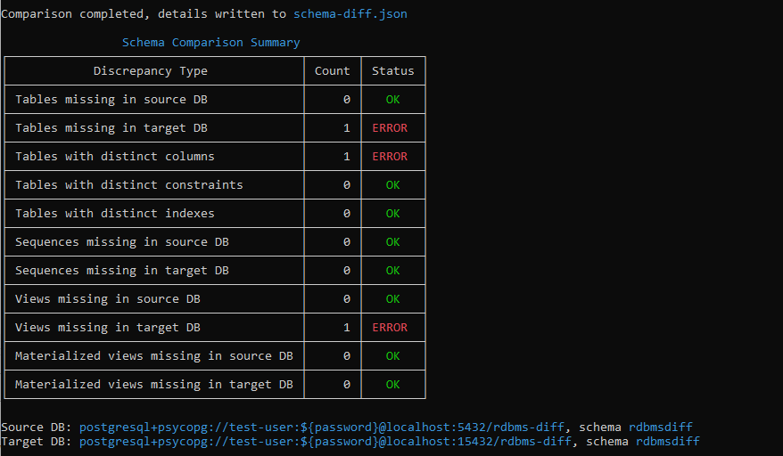
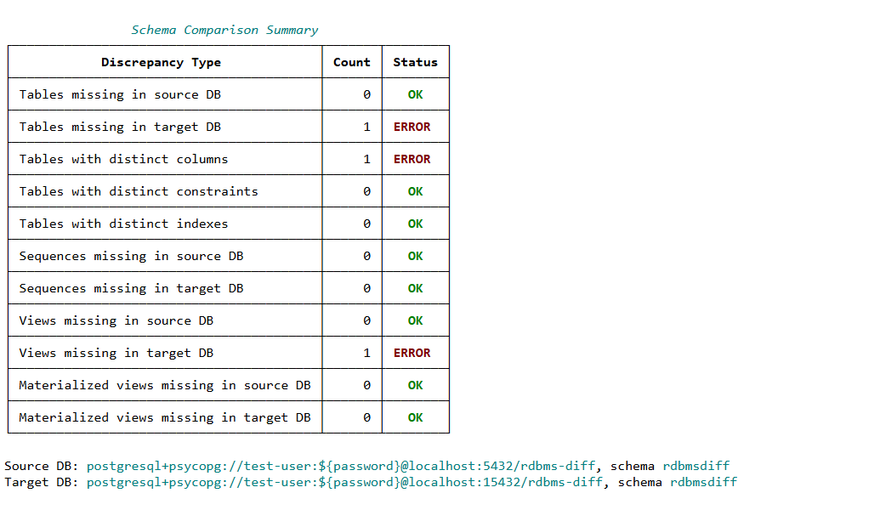
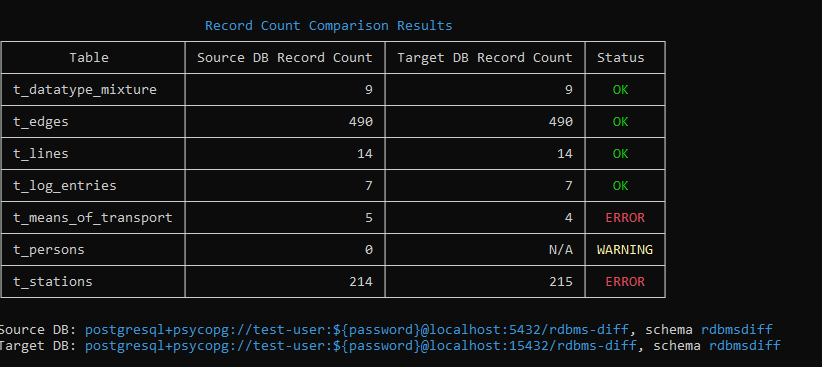
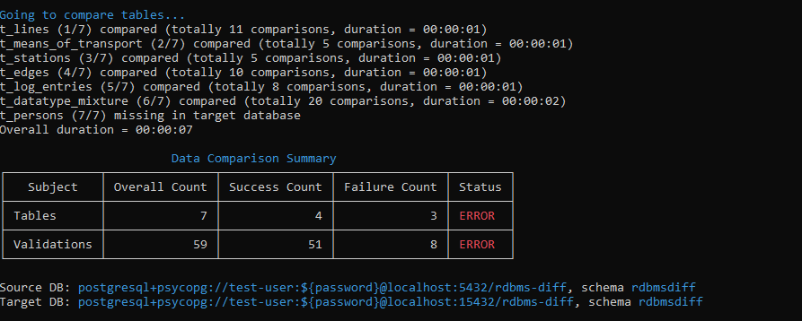
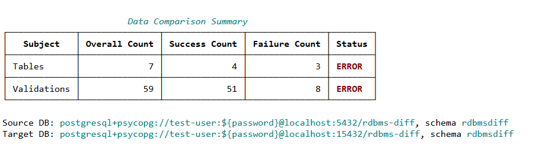

# RDBMS Diff - Tools for Comparison of Relational Databases

## Introduction
RDBMS Diff is a set of tools allowing to compare two relational databases. It is meant for use cases like:
* Database migration, for instance a migration from on-prem Oracle to AWS Aurora/Postgres. Such a use case was the original trigger for the development of the tool.
* Cloning of databases, for instance cloning of a production database to a test environment, or cloning a database from one cloud region to another cloud region.
The list of use cases outlined above is not complete, these are just few examples.

The following comparisons are provided:
* **Schema comparison** is able to detect situations when the schema of one of the databases accidentally deviates from the schema of the other database. Missing table, missing foreign key constraint or inconsistent datatype of a table column are examples of such a deviation.
* **Record count comparison** is able to detect situations when the overall number of records in a table in one of the database differs from the overall number of records in the same table in the other database.
* **Data comparison** is able to detect situations when a record in one of the databases has at least one column value distinct from its counterpart in the other database.

Implementing a completely generic tool that would be able to compare any combination of database engines, all possible datatypes etc. is more or less impossible (or at least very expensive in terms of implementation effort). Therefore, the tool should rather be seen as a solid foundation which can be forked and customized if it does not fully support some specific scenario.

## Source Code Organization
The source code is divided to four Python packages:
* [rdbmsdiff.foundation](./rdbmsdiff/foundation) package provides functionality common to two or more comparison tools. The classes and functions provided by this package are reusable, and the comparison tools are built on top of this reusable functionality. For instance, each of the three tools needs to read some meta-information from the compared databases. Therefore, the corresponding functionality is provided by the foundation package.
* [rdbmsdiff.schema](./rdbmsdiff/schema) package implements the comparison tool providing the schema comparison.
* [rdbmsdiff.recordcount](./rdbmsdiff/recordcount) implements the comparison tool comparing the overall number of records per table.
* [rdbmsdiff.data](./rdbmsdiff/data) implements the comparison tool comparing the records and detecting discrepancies in column values.

As outlined above, the packages implementing the three comparison tools depend on the foundation package. However, the packages implementing the comparison tools are independent of each other.


## Dependencies
All 3rd party dependencies (i.e. [pypi.org](https://pypi.org) packages) are documented in the [requirements.txt](./requirements.txt) file. If these packages are installed, all three comparison tools should work. The following list provides an overview of all dependencies and their purpose.
* [rich](https://pypi.org/project/rich/) package is used to generate pretty CLI output and HTML reports.
* [SQLAlchemy](https://pypi.org/project/SQLAlchemy/) is used as vendor independent database interface that ensures the capability of the comparison tools to interact with various database engines.
* [psycopg](https://pypi.org/project/psycopg) is a database adapter for PostgreSQL databases.
* [mysqlclient](https://pypi.org/project/mysqlclient/) is a database adapter for MySQL databases.
* [mariadb](https://pypi.org/project/mariadb) is a database adapter for MariaDB databases.

If you would like to use the comparison tools for other database engine like Oracle, you will have to take care about the corresponding database adataper(s).

## Schema Comparison Tool
The following command will display instructions about how to start schema comparison.
```
python -m rdbmsdiff.schema.main -h
```

The comparison generates a summary to the standard output (see the screenshot below).


The generated summary can optionally be duplicated to an HTML file. The HTML summary hasa exactly the same structure as the summary written to the standard output.


Besides the summary, the tool also generates detailed report with all discrepancies found during the comparison. The report is written to a file in JSON format. The following screenshot illustrates the structure of the report.


Meta-information about schema is retrieved using SQLAlchemy API. In other words, the comparison tools do not query any vendor-specific system views directly. This approach keeps the reading of schema information vendor independent.

## Record Count Comparison Tool
The following command will display instructions about how to start comparison of record count for particular tables.
```
python -m rdbmsdiff.recordcount.main -h
```

The comparison generates a summary to the standard output (see the screenshot below). The generated summary can also be duplicated to an HTML file.


The generated summary can optionally be duplicated to an HTML file. The HTML summary hasa exactly the same structure as the summary written to the standard output.


## Data Comparison Tool
The following command will display instructions about how to start data comparison.
```
python -m rdbmsdiff.data.main -h
```

The comparison generates a summary to the standandard output (see the screenshot below).


The generated summary can optionally be duplicated to an HTML file. The HTML summary hasa exactly the same structure as the summary written to the standard output.


Besides the summary, the tool also generates a detailed report where you can see the details of every single validation.


TODO:
- describe the report written to TXT file
    * separate section for each table
    * the section begins with the name of the table and a summary of validations performed for the table
    * within the section, there are subsections - one subsection per validation
    * each subsection begins with information about the validated column, the name of the validator, and the outcome of the validation
    * for each of the two databases, you see the validation SQL statement and the corresponding result-set
    * if the execution of the SQL statement leads to an exception, the details of the exception are provided
- eventual need for customization of data validation

## Test Databases (Docker Images)
The [test-db](./test-db) directory structure contains Dockerfiles and SQL scripts that can be used to build Docker images with test databases based on various database engines. These databases can be used to test the tools comprising RDBMS Diff.
